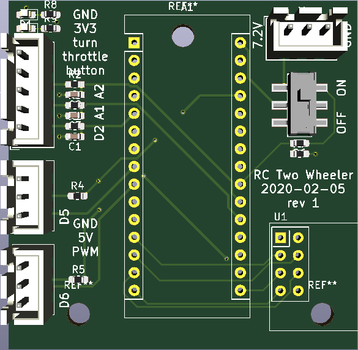

# RC two wheeler
A 4 kW RC car with overkill BLDC motors and two VESCs and a 5 kW LiPo.  

## Hardware
- Flipsky VESC v4.12 x 2
- KEDA 63-64 190KV 2kW x 2
- Arduino Nano x2
- nRF24 x2
- 3S 60C 4000 mAh Turnigy Heavy duty LiPo
- Joystick 
- ~~2P2S N.E.S.E module x 2~~
- ~~Samsung 25E á 20A x 8~~
- ~~FrSky transmitter~~
- ~~RF Reciever~~

### PCB
- PWM/5V/GND in
- Nano
- nRF24 
- ON/OFF
- Battery
- Joystick  

## Software
- VESC Tool v0.95. 
- VSCode project for Nano. 

